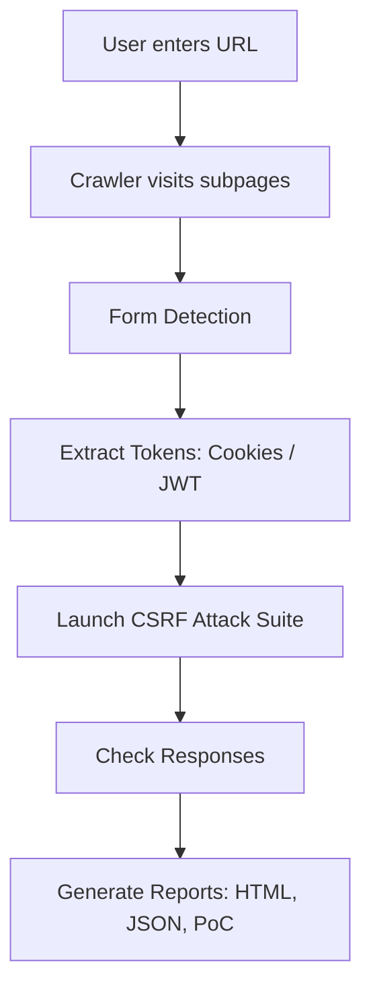

# 🛡️ B-Secure: Automated CSRF Vulnerability Detection Suite

B-Secure is a **fully automated security testing framework** that detects and exploits **Cross-Site Request Forgery (CSRF) vulnerabilities** in both **static and dynamic web applications**.
All you need to do is **enter a target site URL** — the suite will:

1. **Crawl** through all sub-links and forms
2. **Extract session tokens** (Cookies / JWT / Headers)
3. **Launch a wide range of CSRF attack vectors** (basic + advanced)
4. **Classify results** as `Exploited ✅` or `Not Applicable (JWT/CSRF-Proof)`
5. **Generate detailed reports** in multiple formats (HTML, JSON, Exploited Only, PoC cURL commands)

---

## 🚀 Key Features

* 🔎 **Deep Crawler** — recursively scans sub-links and detects forms/form-like actions
* 🔐 **Token Extraction** — retrieves session cookies and JWT tokens automatically
* 🧨 **Attack Suite** — launches a wide range of CSRF attack payloads:

  * Image/script/iframe GET requests
  * Hidden form POST submissions
  * Fetch/XHR with cookies or headers
  * Multipart/form-data uploads
  * Advanced bypasses: **Duplicate Tokens, SameSite Refresh, Referer Bypass, Subdomain Bypass, Method Override**
* 📊 **Multi-Format Reports** — auto-generated:

  * Full HTML Report
  * Exploited Only HTML Report
  * JSON (full + exploited)
  * PoC cURL command file
* ✅ **Smart Classification**

  * Exploited ✅ → Vulnerability confirmed
  * Not Applicable → Token scheme (JWT/header-based) resists CSRF
  * HTTP Error → Request blocked

---

## 📂 Project Structure

```
B-Secure/
│── csrf_suite_cli.py     # Core CSRF attack suite
│── auto_full.py          # Automation: crawling + token extraction + orchestration
│── reports/              # Auto-generated reports stored here
│── requirements.txt      # Python dependencies
│── README.md             # Documentation
```

---

## 🔧 Installation

1. **Clone the repository**

```bash
git clone https://github.com/<your-repo>/b-secure.git
cd b-secure
```

2. **Set up Python environment**

```bash
python3 -m venv venv
source venv/bin/activate   # On Linux/Mac
venv\Scripts\activate      # On Windows
```

3. **Install dependencies**

```bash
pip install -r requirements.txt
```

Dependencies include:

* `requests`
* `beautifulsoup4`
* `selenium`
* `playwright`
* `jinja2`

(⚡ Run `playwright install` after installing dependencies.)

---

## ▶️ Usage

### 1. Run Automated Mode (Recommended)

This will crawl, extract tokens, attack, and generate reports:

```bash
python3 auto_full.py \
  --base https://juice-shop.herokuapp.com \
  --login-path /#/login \
  --username testemail123@gmail.com \
  --password password123@24 \
  --username-field "input[name='email']" \
  --password-field "input[name='password']" \
  --login-button "button#loginButton" \
  --depth 3
```

Outputs are saved in `reports/` with timestamped filenames.

---

### 2. Run CLI Mode (Custom Config)

You can manually define attack targets via a JSON config:

```bash
python3 csrf_suite_cli.py --config config.json
```

---

## 📊 Example Reports

### Exploited Report (HTML)

✅ Shows which vectors worked against which forms:

* `form_1 → img_get (200)`
* `form_1 → fetch_post (200)`
* Mitigation suggestions automatically included.

### JSON Output

Structured machine-readable logs for integration with other tools.

### PoC (cURL) File

Each attack vector produces a `curl` command that you can re-run to reproduce.

---

## 🔥 Attack Flow (Diagram)



---

## 🛠️ System Architecture (Diagram)

```mermaid
graph LR
    U[User enters site URL] --> C1[Crawler: Selenium + Requests]

    subgraph B-Secure
        C1 --> F1[Form Extractor]
        F1 --> T1[Token Extractor (Cookies/JWT)]
        T1 --> A1[Attack Suite: Basic + Advanced Vectors]
        A1 --> R1[Report Generator: Jinja2 Templates]
    end

    R1 --> O[Outputs: HTML + JSON + Exploited + PoC (cURL)]
```

---

## 💡 Wow Factors

* Fully **automated end-to-end CSRF testing**
* Handles **static + dynamic sites** (Selenium + Playwright hybrid)
* **JWT detection** → marks attacks as not applicable
* **Crawls deeply** into sublinks to maximize coverage
* Generates **professional reports** with exploits & mitigations

---

## 👥 Team

**Team Name**: 🛡️ B-Secure

* Built for hackathons & security challenges
* Focused on making **security testing simple, automated, and powerful**

---

## ⚠️ Disclaimer

This tool is for **educational and authorized security testing only**.
Do **NOT** use against systems you do not own or have explicit permission to test.


